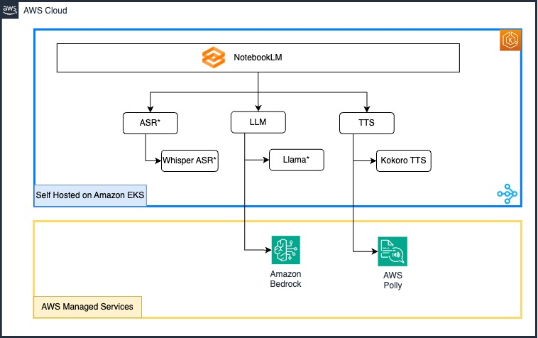
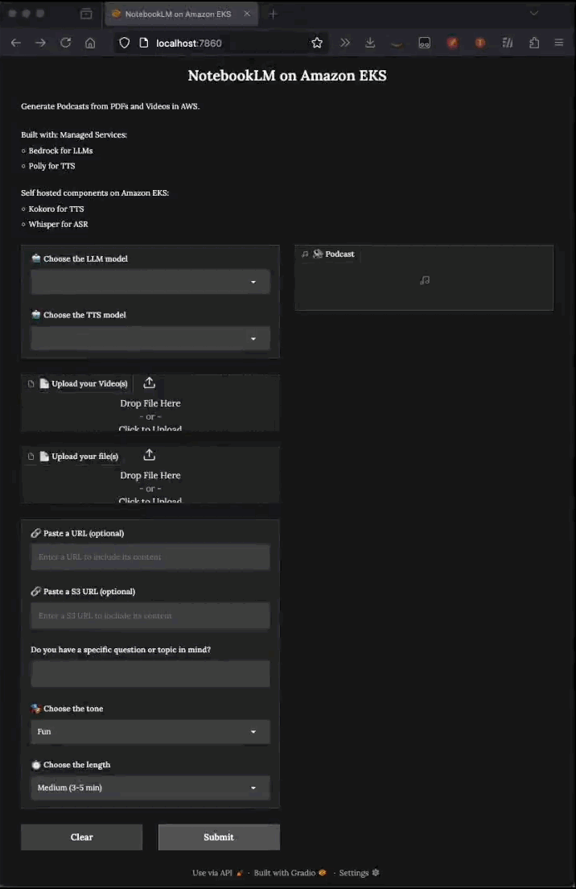

# NotebookLM with Amazon Bedrock and Amazon EKS
Build using Gradio, this application leverages Amazon Bedrock & LLMs hosted on Amazon EKS for generating dialogues and creating audio content using various text-to-speech services.
- Generates conversational style podcasts from PDFs and Videos in AWS.
- Notebooklm is developed using Gradio, and is hosted on Amazon EKS.
- Notebooklm depends on Text-to-speech(TTS), Speech-to-text(STT), Large Language Model(LLM) services, to convert input content to podcast.
- We can configure either a managed hosted services from Amazon, or self-hosted services deployed on Amazon EKS.
- NOTE: Services deployed on Amazon EKS will spin up accelerated instances like GPUs and Inferentia. Ensure to tear it down, once testing is complete.

# Solution Components

 
\*[WIP]: Currently can be deployed as standalone service on Amazon EKS. This can be integrated with NotebookLM. Contributors are welcome. :)

Application Flow:
- The system accepts various inputs (text, PDFs from S3/local, URLs, or video files) and processes them into clean, structured content.
- The user is also provided with choice of models to be used for generating the content.
- Using either Amazon Bedrock or LLM model hosted on Amazon EKS, it generates natural conversational dialogue and refines it for better engagement and flow.
- Finally, the dialogue is converted into audio using either Amazon Polly or Kokoro TTS, with distinct voices for different speakers.

Why Amazon EKS for hosting LLM Models?
- Scalability & Performance: Automatically scale your AI/ML workloads with support for GPU and AWS Neuron instances.
- Integration: Leverage native support for popular ML frameworks like TensorFlow, PyTorch, and Ray.
- Management: Simplify operations with automated tasks, built-in monitoring, and self-healing capabilities, ensuring your LLM deployments remain reliable

# Demo


# Setup Instructions

## Build Images
```
cd notebook-lm
chmod +x build.sh && ./build.sh

cd ../whisper-asr
chmod +x build.sh && ./build.sh
```

## Push Images
ECR Login
```
aws ecr get-login-password --region us-west-2 | docker login --username AWS --password-stdin 0123456789.dkr.ecr.us-west-2.amazonaws.com
```
Tag & Push Images (Replace with the appropriate account ID, region and repo)
```
# opennotebooklm
docker tag opennotebooklm:latest 0123456789.dkr.ecr.us-west-2.amazonaws.com/opennotebooklm:latest
docker push 0123456789.dkr.ecr.us-west-2.amazonaws.com/opennotebooklm:latest

# whisper ASR
docker tag ray-whisper:latest 0123456789.dkr.ecr.us-west-2.amazonaws.com/ray-whisper:latest
docker push 0123456789.dkr.ecr.us-west-2.amazonaws.com/ray-whisper:latest
```

## Update deployment manifests with correct ImageIDs
- `notebook-lm/deployment/notebook-lm-deployment.yaml`
- `whisper-asr/deployment/whisper-asr.yaml`

## Deploy the notebooklm application stack
```
kubectl apply -f notebook-lm/deployment/notebooklm-sa.yaml
kubectl apply -f notebook-lm/deployment/notebook-lm-deployment.yaml
kubectl apply -f kokoro/deployment/kokoro-tts.yaml
```

(Optional & WIP): Deploy Whisper-ASR on EKS
```
kubectl apply -f whisper-asr/deployment/whisper-asr.yaml
```

## Accessing the NotebookLM
NotebookLM is exposed as `ClusterIP`. From your local system, use `port-forward` to access the application:
```
kubectl port-forward svc/notebooklm-svc 7860:7860
```

From the local browser, the application can be accessed using:
```
http://localhost:7860/
```

## Cleanup
### Delete the deployments on Amazon EKS
```
kubectl delete -f notebook-lm/deployment/notebook-lm-deployment.yaml
kubectl delete -f kokoro/deployment/kokoro-tts.yaml
kubectl delete -f whisper-asr/deployment/whisper-asr.yaml
```

Also delete Container images & its corresponding repository on Amazon ECR
- `0123456789.dkr.ecr.us-west-2.amazonaws.com/opennotebooklm`
- `0123456789.dkr.ecr.us-west-2.amazonaws.com/ray-whisper`

## Contribute
- While we have picked `kokoro` as one of the open source TTS model, there are other TTS models like [Zonos](https://github.com/Zyphra/Zonos). We can host this and provide more options to choose from.
- The NotebookLM application requires updates to connect with the independently deployed `WhisperASR` and `Llama` services currently running on Amazon EKS clusters.

## References
- [Notebooklm](https://github.com/aws-samples/amazon-nova-samples/tree/main/multimodal-understanding/sample-apps/02-bedrock-notebook-lm)
- [Kokoro](https://github.com/remsky/Kokoro-FastAPI)
