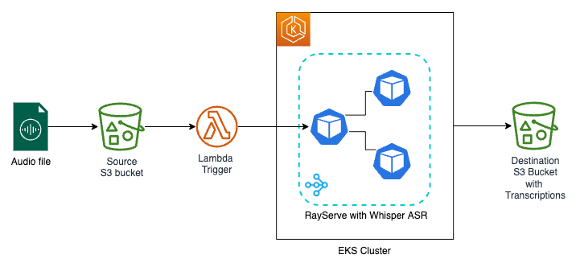

# Instructions for Whisper ASR standalone setup

## Architecture
This sample architecture demonstrates how to automatically transcribe multiple audio files using Whisper ASR.



## Deploying EKS Cluster
1. Clone the repo
```
git clone https://github.com/awslabs/data-on-eks.git
```

2. Update region
Update region in `variables.tf` and also set the environment variable:
```
export AWS_DEFAULT_REGION="<REGION>"
```

3. Run the installation script, which will deploy new EKS Cluster, along with all the addons, operators & tools

```
cd data-on-eks/ai-ml/jark-stack/terraform && chmod +x install.sh
./install.sh
```

4. Update kubeconfig
```
aws eks --region us-west-2 update-kubeconfig --name jark-stack
```

5. Verify resources
```
kubectl get nodes
kubectl get nodepools
kubectl get pods -n nvidia-device-plugin
kubectl get pods -n kuberay-operator
```

## Build and push Whisper Image

```
docker build -t genai/ray-whisper:v1 .
docker tag genai/ray-whisper:v1 <<your_repo_name>>/ray-whisper:v1
docker push <<your_repo_name>>/ray-whisper:v1
```

## Deploy Whisper ASR as Ray Serve Application
Remember to update the `image` under `headGroupSpec.template.spec.containers` and `workerGroupSpecs.template.spec.containers`
```
kubectl apply -f whisper-stand.yaml
```
Check RayCluster
```
kubectl get raycluster
kubectl get pods
kubectl get svc
```


Invoke Whisper-ASR
```
curl -X POST -H 'Content-Type: application/json' whisper-stand-raycluster-xqm4m-head-svc:8000/whisper/ -d '{"file_path": "audio.mp3"}'
```
